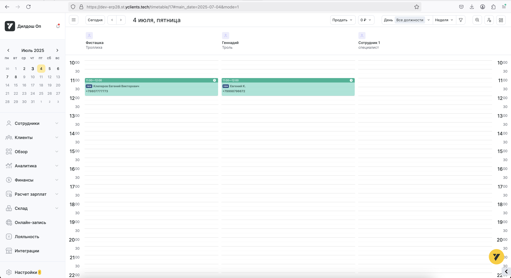

# Плагин отображения имени клиента (timetable-record-client-name)

## Репозиторий

<https://gitlab.yclients.tech/platform/plugins/yclients/example-plugin/frontend/-/tree/master/apps/timetable-record-client-name?ref_type=heads>

## Что делает

Плагин отображает полное имя клиента (фамилия, имя, отчество) в расписании записей. Плагин получает персональные данные клиента от хоста и форматирует их в читаемый вид для отображения в пользовательском интерфейсе.

**Пример работы**: `Клеперов Евгений Викторович` вместо сокращенного "Евгений К."



\*_Рис. 1. Пример отображения полного и сокращенного ФИО клиента в таблице записи_

## Поддерживаемые зоны

Плагин поддерживает работу в нескольких зонах ERP-системы:

- **erp-timetable-controls** - зона элементов управления расписанием
- **erp-timetable-record-client-name** - зона отображения имени клиента в записи

Конфигурация зон определяется в `contract.json`:

```json
{
  "timetable-record-client-name": {
    "application": "erp",
    "areas": ["erp-timetable-controls", "erp-timetable-record-client-name"]
  }
}
```

## Принцип работы

### Старт работы плагина

Запуск плагина происходит через функцию `initializePlugin` в файле `plugin.ts` ([репозиторий](https://gitlab.yclients.tech/platform/plugins/yclients/example-plugin/frontend/-/blob/master/apps/timetable-record-client-name/src/plugin.ts)). Плагин поддерживает как автоматическую, так и ручную инициализацию.

#### Автоматическая инициализация

При импорте основного модуля плагин автоматически инициализируется:

```typescript
// index.ts
import { initializePlugin } from './plugin';

// Инициализируем плагин и сохраняем функцию отписки
const cleanup = initializePlugin();

// Экспортируем функцию очистки для возможности ручного вызова
export { cleanup };
```

#### Ручная инициализация

Для более детального контроля можно использовать ручную инициализацию:

```typescript
import { initializePlugin, cleanupPlugin } from './plugin';

// Инициализация плагина
const cleanup = initializePlugin();

// При необходимости - ручная очистка
cleanup();
```

### Архитектура событий

Плагин использует улучшенную архитектуру событий на основе `@yclients-plugins/utils`:

#### Динамическое создание имен событий

```typescript
// Создаем имена событий хоста для всех зон
const HOST_EVENT_NAMES = Object.fromEntries(
  PLUGIN_AREAS.map((area) => [area, createHostEventNames(area)]),
) satisfies Record<string, THostEventNames>;
```

#### Обработка событий хоста

Плагин подписывается на события `HOST_EVENT_NAMES.READY` для всех поддерживаемых зон:

```typescript
export function initializePlugin(): () => void {
  console.log('[Plugin] Инициализация плагина');

  // Подписываемся на события готовности хоста для всех зон
  PLUGIN_AREAS.forEach((area) => {
    const hostEventNames = HOST_EVENT_NAMES[area];
    if (hostEventNames) {
      hostEventEmitter.onDocument(hostEventNames.READY, handleHostReadyEvent);
    }
  });

  // Подписываемся на события жизненного цикла window
  window.addEventListener('beforeunload', handleBeforeUnload);

  // Возвращаем функцию отписки
  return cleanupPlugin;
}
```

### handleHostReadyEvent

Обработчик события готовности хоста выполняет следующие действия:

1. Получает данные о клиенте (имя, фамилия, отчество) из payload события
2. Находит контейнер для отображения по containerId
3. Проверяет существование контейнера и логирует ошибку при его отсутствии
4. Форматирует полное имя клиента с помощью ClientNameService
5. Заменяет содержимое контейнера на отформатированное имя
6. Создает уникальное имя события плагина на основе containerId
7. Отправляет событие о готовности плагина

```typescript
const handleHostReadyEvent = (event: CustomEvent<THostReadyEvent>): void => {
  console.log('[Plugin] Получено событие готовности хоста:', event);
  const { containerId, payload } = event.detail;

  const container = document.querySelector(
    `[data-plugin-container="${containerId}"]`,
  );

  if (!container) {
    console.error(`[Plugin] Контейнер "${containerId}" не найден`);
    return;
  }

  // Формируем полное имя клиента с помощью сервиса
  const fullName = ClientNameService.formatFullName(payload);
  container.replaceChildren(fullName);

  // Создаем уникальные имена событий плагина для данного контейнера
  // Это позволяет избежать конфликтов при множественной инициализации
  const PLUGIN_EVENT_NAMES = createPluginEventNames(containerId);

  // Отправляем событие о готовности плагина
  pluginEventEmitter.emit(PLUGIN_EVENT_NAMES.READY);
};
```

### ClientNameService

([репозиторий](https://gitlab.yclients.tech/platform/plugins/yclients/example-plugin/frontend/-/blob/master/apps/timetable-record-client-name/src/services/client-name.service.ts))

Сервис для работы с именами клиентов предоставляет методы для форматирования и обработки персональных данных клиентов:

```typescript
export class ClientNameService {
  /**
   * Создает читаемое представление клиента для отображения в пользовательском интерфейсе.
   *
   * @param personalData - Персональные данные клиента.
   * @returns Готовое к отображению полное имя клиента.
   */
  static formatFullName({
    clientSurname,
    clientName,
    clientPatronymic,
  }: THostReadyPayload): string {
    return [clientSurname, clientName, clientPatronymic]
      .map((part) => part?.trim())
      .filter(Boolean)
      .join(' ');
  }
}
```

Сервис принимает персональные данные клиента и возвращает отформатированную строку с полным именем. Метод:

- Удаляет лишние пробелы из каждой части имени
- Фильтрует пустые значения
- Объединяет части имени через пробел

**Примеры**:

- `["Иванов", "Иван", "Иванович"]` → `"Иванов Иван Иванович"`
- `["Петров", "", "Сергеевич"]` → `"Петров Сергеевич"`
- `["  Сидоров  ", "Алексей", null]` → `"Сидоров Алексей"`

### Управление жизненным циклом

Плагин включает улучшенное управление жизненным циклом с автоматической и ручной очисткой ресурсов:

#### Автоматическая очистка

Плагин автоматически отписывается от событий при:

- Выгрузке страницы (`beforeunload`)

```typescript
const handleBeforeUnload = (): void => {
  console.log('[Plugin] Страница выгружается, выполняем очистку');
  cleanupPlugin();
};
```

#### Ручная очистка

Функция `cleanupPlugin` отписывается от всех событий и очищает ресурсы плагина:

```typescript
export function cleanupPlugin(): void {
  console.log('[Plugin] Отписка от событий хоста и плагина');

  // Отписываемся от событий готовности хоста для всех зон
  PLUGIN_AREAS.forEach((area) => {
    const hostEventNames = HOST_EVENT_NAMES[area];
    if (hostEventNames) {
      hostEventEmitter.offDocument(hostEventNames.READY, handleHostReadyEvent);
    }
  });

  // Отписываемся от события жизненного цикла window
  window.removeEventListener('beforeunload', handleBeforeUnload);
}
```

### Множественная инициализация

Плагин поддерживает множественную инициализацию благодаря динамическому созданию имен событий:

- **События хоста**: Используют динамические имена на основе зон из contract.json
- **События плагина**: Создаются динамически как `plugin:{containerId}:ready`

Это позволяет:

- Избежать конфликтов имен событий между разными экземплярами
- Каждому контейнеру иметь свое уникальное событие готовности
- Корректно обрабатывать множественные инициализации в разных зонах

### Типы событий

([репозиторий](https://gitlab.yclients.tech/platform/plugins/yclients/example-plugin/frontend/-/blob/master/apps/timetable-record-client-name/src/types/events.ts))

Плагин использует систему событий для коммуникации с хостом:

#### Входящие события (от хоста)

**THostReadyEvent** - событие готовности хоста, содержит данные клиента:

```typescript
export type THostReadyPayload = {
  clientName: string; // Имя клиента
  clientSurname: string; // Фамилия клиента
  clientPatronymic: string; // Отчество клиента
};

export type THostReadyEvent = THostToPluginEvent<THostReadyPayload>;
```

#### Исходящие события (к хосту)

**TPluginReadyEvent** - событие готовности плагина, отправляется после инициализации:

```typescript
export type TPluginReadyEvent = TPluginToHostEvent<null>;
```

### Обработка ошибок

#### Отсутствующий контейнер

Если контейнер с указанным `containerId` не найден:

- Ошибка логируется в консоль
- Событие готовности плагина не отправляется

```typescript
if (!container) {
  console.error(`[Plugin] Контейнер "${containerId}" не найден`);
  return;
}
```

### Обработка множественной инициализации

При множественной инициализации плагина:

- Каждый экземпляр подписывается на события хоста для всех зон независимо
- События плагина создаются с уникальными именами для каждого контейнера
- Функция очистки отписывает от событий хоста для всех зон
- Рекомендуется использовать один экземпляр на страницу

## Зависимости

Плагин использует следующие основные зависимости:

- `@yclients-plugins/utils` - утилиты для работы с событиями и эмиттерами
- `@yclients-configs/vite` - конфигурация сборки

### Конфигурация из contract.json

Плагин получает конфигурацию из центрального файла `contract.json`:

```json
{
  "timetable-record-client-name": {
    "application": "erp",
    "areas": ["erp-timetable-controls", "erp-timetable-record-client-name"]
  }
}
```

## Сборка и разработка

```bash
# Установка зависимостей
npm install

# Запуск в режиме разработки
npm run dev

# Сборка для продакшена
npm run build

# Проверка типов
npm run typecheck

# Линтинг
npm run lint

# Тестирование
npm run test:unit

# Очистка
npm run clean
```

## Примеры использования

### Базовое использование

```html
<div data-plugin-container="client-name-container-1"></div>
<div data-plugin-container="client-name-container-2"></div>
```

```typescript
// Хост отправляет события для разных контейнеров в разных зонах
hostEventEmitter.emit('host:erp-timetable-controls:ready', {
  containerId: 'client-name-container-1',
  payload: {
    clientName: 'Иван',
    clientSurname: 'Иванов',
    clientPatronymic: 'Иванович',
  },
});

hostEventEmitter.emit('host:erp-timetable-record-client-name:ready', {
  containerId: 'client-name-container-2',
  payload: {
    clientName: 'Петр',
    clientSurname: 'Петров',
    clientPatronymic: 'Петрович',
  },
});

// Результат:
// - В первом контейнере: "Иванов Иван Иванович"
// - Во втором контейнере: "Петров Петр Петрович"
// - Отправляются события: plugin:client-name-container-1:ready и plugin:client-name-container-2:ready
```

### Интеграция с Vue

```vue
<template>
  <div data-plugin-container="client-name-container"></div>
</template>

<script setup>
import { onMounted, onUnmounted } from 'vue';
import { initializePlugin, cleanupPlugin } from './plugin';

let cleanup: (() => void) | null = null;

onMounted(() => {
  cleanup = initializePlugin();
});

onUnmounted(() => {
  if (cleanup) {
    cleanup();
  }
});
</script>
```

### Интеграция с React

```tsx
import { useEffect } from 'react';
import { initializePlugin, cleanupPlugin } from './plugin';

function ClientNameComponent() {
  useEffect(() => {
    const cleanup = initializePlugin();

    return () => {
      cleanup();
    };
  }, []);

  return <div data-plugin-container="client-name-container" />;
}
```

### Тестирование с хостом

Для тестирования плагина используется файл `host.ts`, который эмулирует работу хоста:

```typescript
// Инициализация хоста для тестирования
import { initializeHost } from './host';

// Инициализируем хост, который отправит события готовности для всех зон
initializeHost();
```

## Требования

- Node.js 18+
- npm 8+
- TypeScript 5.0+
- Vite 5.0+

## Архитектурные улучшения

### Поддержка множественных зон

Плагин теперь поддерживает работу в нескольких зонах ERP-системы, что позволяет:

- Использовать один плагин в разных частях интерфейса
- Централизованно управлять логикой отображения имен клиентов
- Избежать дублирования кода между разными зонами

### Улучшенная система событий

Новая архитектура событий обеспечивает:

- Типобезопасность при работе с событиями
- Динамическое создание имен событий на основе конфигурации
- Лучшую изоляцию между разными экземплярами плагина
- Упрощенное тестирование и отладку

### Конфигурация через contract.json

Централизованная конфигурация позволяет:

- Легко добавлять новые зоны поддержки
- Изменять поведение плагина без изменения кода
- Обеспечивать консистентность конфигурации между разными средами
