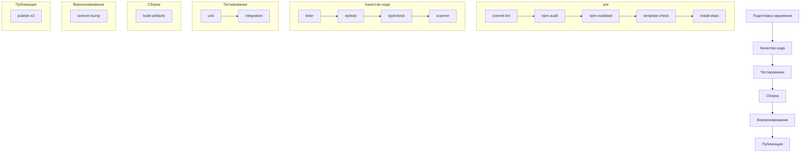

# Документация процесса CI/CD

Этот документ описывает процесс непрерывной интеграции и непрерывной доставки (CI/CD) для рабочего процесса разработки плагина.

## Обзор

Конвейер CI/CD состоит из нескольких этапов, которые выполняются строго последовательно для обеспечения качества кода, безопасности и надежной доставки плагина. Каждый этап содержит набор конкретных задач, которые выполняются параллельно внутри своего этапа для оптимизации времени выполнения. Последовательность этапов гарантирует корректность процесса сборки, в то время как параллельное выполнение задач внутри этапов позволяет ускорить общее время выполнения конвейера.

Этапы выполняются в следующем порядке:

1. Подготовка окружения (.pre)
2. Качество кода
3. Тестирование
4. Сборка
5. Версионирование
6. Публикация

Каждый этап не может начаться, пока не завершится предыдущий этап. Однако все задачи внутри одного этапа запускаются одновременно и выполняются параллельно.

## Этапы сборки

### 1. Подготовка окружения (.pre)

Этот этап выполняется перед основным процессом сборки для обеспечения правильной настройки и безопасности среды разработки.

#### Задачи подготовки окружения

- **commit-lint**: Проверяет сообщения коммитов на соответствие формату conventional commit

  - Обеспечивает единообразное форматирование сообщений коммитов
  - Помогает поддерживать чистую историю git
  - Облегчает автоматическую генерацию журнала изменений

- **npm-audit**: Выполняет аудит безопасности npm-зависимостей

  - Выявляет известные уязвимости в зависимостях
  - Обеспечивает безопасное использование зависимостей
  - Предотвращает проблемы безопасности в продакшене

- **npm-outdated**: Проверяет устаревшие npm-пакеты

  - Выявляет пакеты, требующие обновления
  - Помогает поддерживать актуальные зависимости
  - Предотвращает накопление технического долга

- **template-check**: Проверяет шаблонизацию репозитория

  - Обеспечивает соответствие структуры репозитория шаблону
  - Проверяет наличие необходимых файлов и директорий
  - Поддерживает согласованность между репозиториями

- **install-deps**: Устанавливает зависимости проекта

  - Устанавливает все необходимые npm-пакеты
  - Обеспечивает воспроизводимость сборки
  - Подготавливает окружение для последующих этапов

### 2. Качество кода

Этот этап фокусируется на поддержании высоких стандартов качества кода.

#### Задачи качества кода

- **linter**: Выполняет статический анализ кода

  - Выявляет потенциальные проблемы в коде
  - Обеспечивает соблюдение стандартов кодирования
  - Обнаруживает распространенные ошибки программирования

- **stylistic**: Проверяет стиль и форматирование кода

  - Обеспечивает единообразное форматирование кода
  - Проверяет соответствие руководству по стилю
  - Поддерживает читаемость кода

- **typecheck**: Выполняет проверку типов TypeScript

  - Проверяет корректность типизации в проекте
  - Выявляет ошибки типов на этапе компиляции
  - Обеспечивает типобезопасность кода

- **scanner**: Выполняет сканирование кода на уязвимости

  - Выявляет потенциальные уязвимости безопасности в коде
  - Анализирует код на наличие известных паттернов уязвимостей
  - Обнаруживает проблемы безопасности в архитектуре приложения
  - Проверяет соответствие требованиям безопасности

### 3. Тестирование

Этот этап обеспечивает корректную работу плагина с помощью различных методов тестирования.

#### Задачи тестирования

- **unit**: Выполняет модульные тесты

  - Тестирует отдельные компоненты
  - Проверяет поведение компонентов
  - Обеспечивает надежность кода

- **integration**: Запускает интеграционные тесты

  - Тестирует взаимодействие компонентов
  - Проверяет поведение системы
  - Обеспечивает сквозную функциональность

### 4. Сборка

Этот этап отвечает за создание артефактов плагина.

#### Задачи сборки

- **build-artifacts**: Собирает артефакты плагина

  - Создает оптимизированную сборку плагина
  - Генерирует необходимые файлы для распространения
  - Подготавливает артефакты для публикации

### 5. Версионирование

Этот этап управляет версионированием плагина.

#### Задачи версионирования

- **semver-bump**: Обрабатывает семантическое версионирование

  - Автоматически увеличивает номера версий
  - Следует принципам семантического версионирования
  - Поддерживает согласованность версий

### 6. Публикация

Этот этап обеспечивает размещение плагина в хранилище артефактов и делает его доступным для использования.

#### Задачи публикации

- **publish-s3**: Публикует плагин в S3

  - Загружает артефакт плагина в S3
  - Делает плагин доступным для распространения
  - Управляет развертыванием плагина

## Схема конвейера

## Лучшие практики

1. **Подготовка окружения**

   - Всегда проверять зависимости перед установкой
   - Следить за актуальностью пакетов
   - Регулярно проводить аудит безопасности
   - Поддерживать соответствие шаблону репозитория

2. **Качество кода**

   - Следовать единому стилю кодирования
   - Поддерживать строгую типизацию
   - Регулярно проводить статический анализ
   - Своевременно исправлять проблемы безопасности
   - Использовать автоматическое форматирование кода

3. **Тестирование**

   - Поддерживать высокое покрытие тестами
   - Писать тесты до реализации функционала (TDD)
   - Тестировать граничные случаи
   - Включать интеграционные тесты
   - Регулярно обновлять тестовые данные

4. **Сборка**

   - Оптимизировать размер артефактов
   - Использовать кэширование для ускорения сборки
   - Генерировать source maps для отладки
   - Проверять корректность сборки в разных окружениях
   - Документировать процесс сборки

5. **Версионирование**

   - Строго следовать семантическому версионированию
   - Вести подробный changelog
   - Тегировать релизы в репозитории
   - Документировать критические изменения
   - Синхронизировать версии зависимостей

6. **Публикация**

   - Проверять артефакты перед публикацией
   - Использовать надежные хранилища
   - Обеспечивать откат изменений
   - Мониторить процесс публикации
   - Документировать процесс развертывания

7. **Безопасность**

   - Регулярно обновлять зависимости
   - Проводить аудит безопасности кода
   - Использовать безопасные практики хранения секретов
   - Следовать принципу наименьших привилегий
   - Мониторить уязвимости в зависимостях

8. **Документация**

   - Поддерживать актуальность документации
   - Документировать все этапы конвейера
   - Описывать процесс отката изменений
   - Вести историю изменений
   - Документировать известные проблемы и их решения

9. **Мониторинг и поддержка**

   - Отслеживать время выполнения этапов
   - Анализировать причины сбоев
   - Оптимизировать производительность
   - Регулярно обновлять инструменты
   - Поддерживать обратную совместимость

10. **Командная работа**
    - Использовать code review
    - Следовать соглашениям по коммитам
    - Поддерживать чистую историю git
    - Делиться знаниями внутри команды
    - Регулярно проводить ретроспективы

## Устранение неполадок

Если этап конвейера завершается с ошибкой:

1. Проверить логи конвейера на наличие конкретных сообщений об ошибках
2. Проверить конфигурацию окружения
3. Убедиться, что все зависимости установлены правильно
4. Просмотреть последние изменения в коде
5. Проверить системные ресурсы

## Соображения безопасности

- Никогда не коммитить конфиденциальную информацию
- Хранить API-ключи и учетные данные в безопасности
- Регулярно обновлять зависимости
- Следовать лучшим практикам безопасности
- Отслеживать уязвимости безопасности

## Обслуживание

- Регулярно проверять и обновлять конфигурацию конвейера
- Отслеживать производительность конвейера
- Обновлять документацию по мере необходимости
- Поддерживать актуальность инструментов и зависимостей
- Периодически проверять и оптимизировать этапы конвейера
