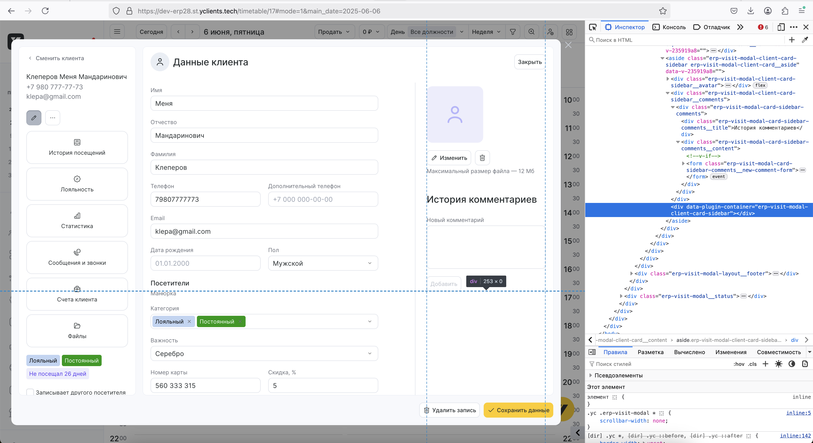
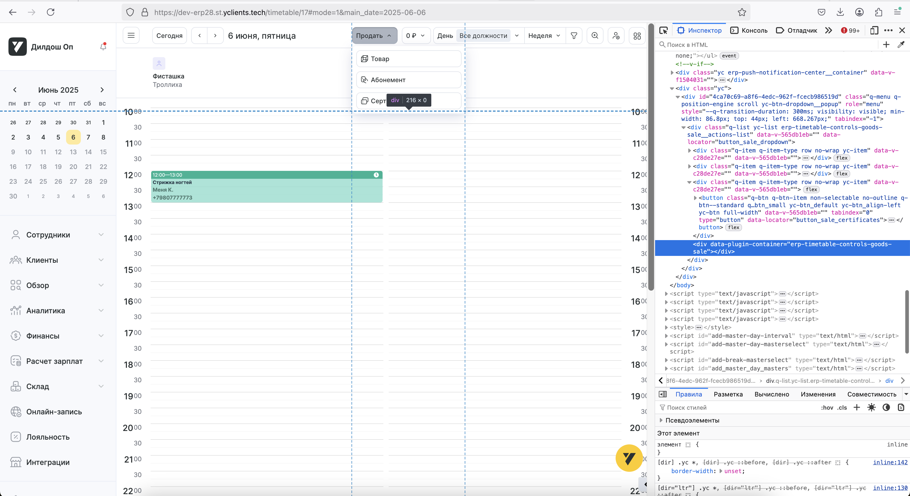
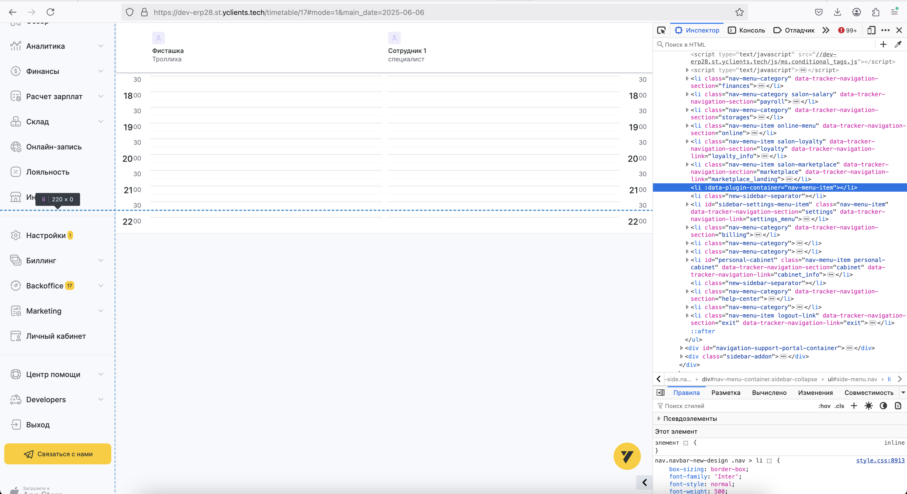

# Точки монтирования плагинов в хост-приложениях

## Обзор

Данный документ описывает стандартизированный подход к созданию точек монтирования плагинов в хост-приложениях. Правильная разметка точек монтирования является критически важной для корректной работы системы плагинов и обеспечения надежной коммуникации между хостом и плагинами.

## Основные принципы

### 1. Использование data-атрибутов

В качестве точки монтирования используется HTML-элемент `div` с обязательным data-атрибутом `data-plugin-container`:

```html
<div data-plugin-container="plugin-zone-name"></div>
```

### 2. Идентификация контейнеров

Значение атрибута `data-plugin-container` представляет собой заранее определенное название зоны.

> **Примечание:** Полный список доступных зон для интеграции плагинов можно найти в [документации по зонам встраивания плагинов](https://wiki.yandex.ru/rnd/product/platform/common-services/extensions-marketplace/7f08bde9f2a2/rukovodstvo-po-sozdaniju-frontend-plagina/kontrakt-i-zony-integracii/zony-vstraivanija-plaginov/?from=%2Frnd%2Fproduct%2Fplatform%2Fcommon-services%2Fextensions-marketplace%2Fzony-vstraivanija-plaginov#zony-vidzheta).

#### Примеры зон встраивания

##### `erp-visit-modal-client-card-sidebar`

Зона для интеграции плагинов в боковую панель модального окна карточки клиента.

```html
<div data-plugin-container="erp-visit-modal-client-card-sidebar"></div>
```



\*_Рис. 1. Боковая панель модального окна карточки клиента_

##### `erp-timetable-controls-goods-sale`

Зона для интеграции плагинов в элементы управления расписанием с функционалом продажи товаров.

```html
<div data-plugin-container="erp-timetable-controls-goods-sale"></div>
```



\*_Рис. 2. Элементы управления расписанием с продажей товаров_;

##### `nav-menu-item`

Зона для интеграции плагинов в элементы навигационного меню.

```html
<div data-plugin-container="nav-menu-item"></div>
```



\*_Рис. 3. Элемент навигационного меню_

## Архитектура точек монтирования

### Схема взаимодействия

```text
Хост-приложение                    Плагин
     |                                |
     | 1. Создание точки монтирования |
     |    <div data-plugin-container> |
     |                                |
     | 2. Отправка containerId        |
     |    в событии ready             |
     |------------------------------->|
     |                                | 3. Монтирование Vue приложения
     |                                |    в указанный контейнер
     |                                |
     |                                | 4. Подтверждение готовности
     |<-------------------------------|
```

### Жизненный цикл контейнера

1. **Создание** - хост-приложение создает HTML-элемент с атрибутом `data-plugin-container`
2. **Инициализация** - хост отправляет событие готовности с `containerId`
3. **Монтирование** - плагин находит контейнер по `containerId` и монтирует свое приложение
4. **Активация** - плагин отправляет подтверждение готовности

## Стандарты именования зон

### Рекомендуемые названия зон

| Зона                                  | Описание                                           | Пример использования                |
| ------------------------------------- | -------------------------------------------------- | ----------------------------------- |
| `erp-visit-modal-client-card-sidebar` | Боковая панель модального окна карточки клиента    | Дополнительная информация о клиенте |
| `erp-timetable-controls-goods-sale`   | Элементы управления расписанием с продажей товаров | Интеграция с системой продаж        |
| `nav-menu-item`                       | Элементы навигационного меню                       | Дополнительные пункты меню          |

### Правила именования

1. **Используйте kebab-case** для названий зон
2. **Будьте описательными** - название должно отражать назначение зоны
3. **Избегайте конфликтов** - используйте префиксы при необходимости
4. **Следуйте конвенциям** - придерживайтесь установленных стандартов

## Примеры реализации

### Базовый пример

```html
<!-- Хост-приложение -->
<div class="client-card-modal">
  <div class="sidebar">
    <div data-plugin-container="erp-visit-modal-client-card-sidebar"></div>
  </div>
</div>
```

```typescript
// Хост отправляет событие готовности
document.dispatchEvent(
  new CustomEvent('host:visit-modal-client-card-sidebar:ready', {
    detail: {
      containerId: 'erp-visit-modal-client-card-sidebar',
      payload: {
        clientId: 1,
      },
    },
  }),
);
```

### Множественные точки монтирования

```html
<!-- Хост-приложение с несколькими плагинами -->
<div class="erp-interface">
  <!-- Плагин боковой панели клиента -->
  <div class="client-modal">
    <div data-plugin-container="erp-visit-modal-client-card-sidebar"></div>
  </div>

  <!-- Плагин управления расписанием -->
  <div class="timetable-section">
    <div data-plugin-container="erp-timetable-controls-goods-sale"></div>
  </div>

  <!-- Плагин навигации -->
  <div class="navigation-section">
    <div data-plugin-container="nav-menu-item"></div>
  </div>
</div>
```

## Обработка в плагинах

### Поиск контейнера

```typescript
// В плагине
hostEventEmitter.onDocument(HOST_EVENT_NAMES.READY, (event) => {
  const { containerId, payload } = event.detail;

  // Поиск контейнера по ID
  const container = document.querySelector(`[data-plugin-container="${containerId}"]`);

  if (!container) {
    console.error(`[Plugin] Контейнер с ID "${containerId}" не найден`);
    return;
  }

  // Монтирование приложения
  const app = createApp(App, { clientId: payload.clientId });
  app.mount(container);
});
```

### Валидация контейнера

```typescript
// Функция валидации контейнера
function validateContainer(containerId: string): HTMLElement | null {
  const container = document.querySelector(`[data-plugin-container="${containerId}"]`);

  if (!container) {
    console.error(`[Plugin] Контейнер "${containerId}" не найден`);
    return null;
  }

  if (!(container instanceof HTMLElement)) {
    console.error(`[Plugin] Контейнер "${containerId}" не является HTML-элементом`);
    return null;
  }

  return container;
}
```

## Лучшие практики

### Для хост-приложений

1. **Создавайте контейнеры заранее** - до отправки событий готовности
2. **Используйте стандартные названия зон** - следуйте установленным конвенциям именования
3. **Обеспечивайте доступность** - контейнеры должны быть видимыми и доступными
4. **Обрабатывайте ошибки** - предусматривайте случаи отсутствия контейнера

### Для плагинов

1. **Валидируйте контейнеры** - проверяйте существование и тип элемента
2. **Обрабатывайте ошибки** - логируйте проблемы с монтированием
3. **Используйте fallback** - предусматривайте альтернативные варианты
4. **Очищайте ресурсы** - корректно размонтируйте приложения

### CSS и стилизация

```css
/* Базовые стили для контейнеров плагинов */
[data-plugin-container] {
  position: relative;
  min-height: 100px;
  width: 100%;
}

/* Стили для загрузки */
[data-plugin-container]:empty::before {
  content: 'Загрузка плагина...';
  display: flex;
  align-items: center;
  justify-content: center;
  height: 100px;
  color: #666;
  font-style: italic;
}

/* Стили для ошибок */
[data-plugin-container].error {
  border: 1px solid #ff4444;
  background-color: #ffeeee;
  padding: 10px;
  color: #cc0000;
}
```

## Обработка ошибок

### Типичные проблемы

1. **Контейнер не найден** - неправильное название зоны или отсутствие элемента
2. **Контейнер недоступен** - элемент скрыт или заблокирован
3. **Неправильное название зоны** - несоответствие стандартам именования
4. **Неправильный тип** - элемент не является HTML-элементом

### Стратегии обработки

```typescript
// Функция безопасного монтирования
function safeMount(containerId: string, app: App): boolean {
  try {
    const container = validateContainer(containerId);

    if (!container) {
      return false;
    }

    // Проверка доступности контейнера
    if (container.offsetParent === null) {
      console.warn(`[Plugin] Контейнер "${containerId}" не видим`);
    }

    app.mount(container);
    return true;
  } catch (error) {
    console.error(`[Plugin] Ошибка монтирования в контейнер "${containerId}":`, error);
    return false;
  }
}
```

## Тестирование

### Unit-тесты для контейнеров

```typescript
// Пример теста для валидации контейнера
describe('Container Validation', () => {
  beforeEach(() => {
    document.body.innerHTML = `
      <div data-plugin-container="test-container"></div>
    `;
  });

  test('should find valid container', () => {
    const container = validateContainer('test-container');
    expect(container).toBeTruthy();
    expect(container?.getAttribute('data-plugin-container')).toBe('test-container');
  });

  test('should return null for invalid container', () => {
    const container = validateContainer('non-existent');
    expect(container).toBeNull();
  });
});
```

### Интеграционные тесты

```typescript
// Пример интеграционного теста
describe('Plugin Mounting Integration', () => {
  test('should mount plugin in container', async () => {
    // Создание контейнера
    const container = document.createElement('div');
    container.setAttribute('data-plugin-container', 'test-zone');
    document.body.appendChild(container);

    // Симуляция события готовности хоста
    const readyEvent = new CustomEvent('host:test:ready', {
      detail: {
        containerId: 'test-zone',
        payload: { iframeUrl: 'test-url' },
      },
    });

    document.dispatchEvent(readyEvent);

    // Проверка монтирования
    await nextTick();
    expect(container.children.length).toBeGreaterThan(0);
  });
});
```

## Заключение

Правильная разметка точек монтирования является фундаментальным аспектом архитектуры плагинов. Следование описанным принципам обеспечивает:

- **Надежность** - корректное монтирование плагинов
- **Масштабируемость** - поддержка множественных экземпляров
- **Совместимость** - стандартизированный подход
- **Отладку** - четкая идентификация проблем

Используйте данную инструкцию как основу для реализации точек монтирования в ваших хост-приложениях и плагинах.
